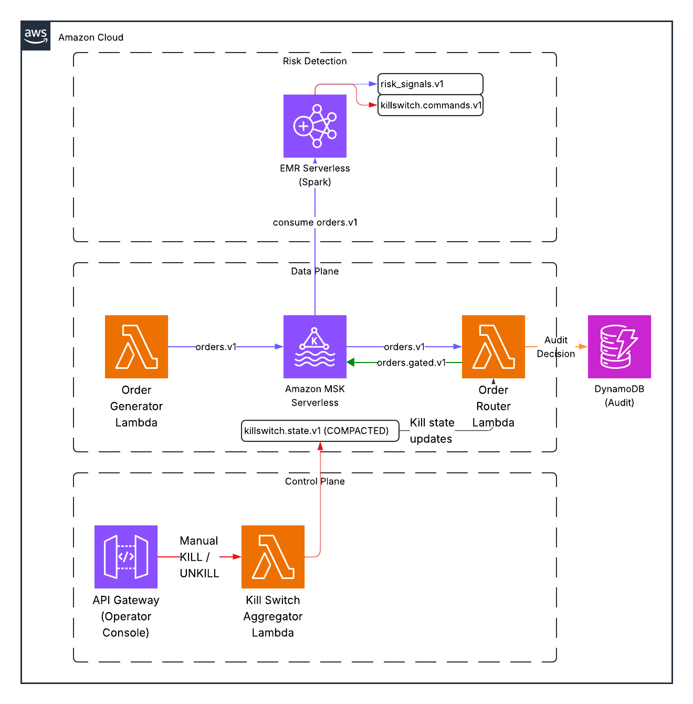
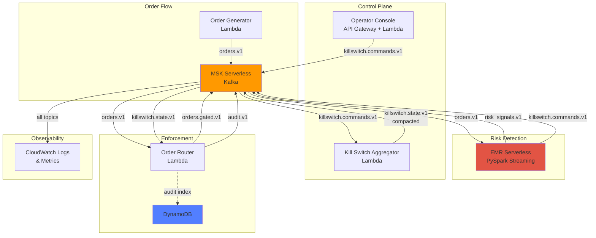

# SEC Rule 15c3-5 Market Access Controls Example

**A graduate-level demonstration of pre-trade risk controls using Kafka + Spark**

## What You'll Learn

This hands-on demo teaches you how to build a serverless streaming risk control system that meets SEC Rule 15c3-5 requirements for broker-dealer market access. You'll deploy a complete event-driven architecture on AWS that detects risky trading patterns in real-time using Spark SQL, enforces kill switches through Kafka's compacted topics, and maintains a full audit trail—all while understanding the regulatory context and learning from the Knight Capital incident of 2012.

## Architecture Overview





## Key Concepts

### Control Plane vs Data Plane
- **Control Plane**: Operator console + kill switch aggregator manage authoritative kill state
- **Data Plane**: Order router enforces kill state on every order in real-time
- **Separation**: Detection (Spark) is decoupled from enforcement (Router)

### Kafka Compaction for Kill State
The `killswitch.state.v1` topic uses Kafka's log compaction to maintain the latest kill status per scope (GLOBAL, ACCOUNT:xxx, SYMBOL:xxx). This provides:
- **Single source of truth**: Latest state is always available
- **Replayability**: New consumers can bootstrap current state
- **Auditability**: Commands topic retains full history

### How This Relates to Brokerage Risk Controls
Real broker-dealers must comply with SEC Rule 15c3-5 (Market Access Rule), which requires:
- Pre-trade risk controls to prevent erroneous orders
- "Direct and exclusive control" over market access
- Supervisory procedures and audit trails

This demo implements these patterns using modern streaming architecture:
- **Direct control**: Centralized kill switch with authoritative state
- **Real-time enforcement**: Every order checked before routing
- **Audit trail**: Immutable log of all decisions with correlation IDs

## Quickstart (AWS)

### Prerequisites
- AWS account with appropriate permissions
- AWS CLI configured (`aws configure`)
- Terraform >= 1.6
- Python 3.11+
- Docker (for Lambda packaging)

### Deploy Infrastructure

```bash
# 1. Build Lambda packages
make build

# 2. Deploy infrastructure
cd terraform/envs/dev
terraform init
terraform apply

# 3. Create Kafka topics
export MSK_BOOTSTRAP=$(terraform output -raw msk_bootstrap_brokers)
./tools/create-topics.sh

# 4. Deploy Spark job
./tools/deploy-spark-job.sh
```

### Run Demo

```bash
# Start order generator (normal mode)
aws lambda invoke --function-name dev-order-generator \
  --payload '{"mode": "normal", "duration_seconds": 300}' \
  response.json

# Watch orders flowing
./tools/tail-topic.sh orders.v1

# Watch risk signals
./tools/tail-topic.sh risk_signals.v1

# Trigger panic mode (high order rate)
aws lambda invoke --function-name dev-order-generator \
  --payload '{"mode": "panic", "account_id": "12345", "duration_seconds": 60}' \
  response.json

# Observe kill command from Spark
./tools/tail-topic.sh killswitch.commands.v1

# Observe state compaction
./tools/tail-topic.sh killswitch.state.v1

# Verify orders are dropped
./tools/tail-topic.sh audit.v1

# Manual unkill via operator console
export API_URL=$(terraform output -raw operator_console_url)
curl -X POST $API_URL/unkill \
  -H "Content-Type: application/json" \
  -d '{"scope": "ACCOUNT:12345", "reason": "Manual override after review"}'
```

## Quickstart (Local)

For classroom environments or quick iteration without AWS:

```bash
# Start local Kafka + services
cd local
docker-compose up -d

# Create topics
docker-compose exec kafka kafka-topics --create --topic orders.v1 \
  --bootstrap-server localhost:9092 --partitions 3 --replication-factor 1

# Run demo
docker-compose exec order-generator python generate.py --mode panic

# Observe (use AKHQ UI at http://localhost:8080)
```

See [docs/02-deploy-local.md](docs/02-deploy-local.md) for full local setup.

## Demo Script (10-12 minutes)

**For live lecture presentation:**

1. **Setup** (2 min): Show architecture diagram, explain control plane vs data plane
2. **Baseline** (2 min): Start normal order flow, show orders.v1 and risk_signals.v1
3. **Trigger** (3 min): Enable panic mode, watch Spark detect threshold breach, emit KILL command
4. **Enforcement** (2 min): Show order router dropping orders, audit trail with correlation IDs
5. **Recovery** (2 min): Operator unkills via console, orders flow again
6. **Compaction** (1 min): Explain how killswitch.state.v1 compaction works

See [docs/03-run-demo.md](docs/03-run-demo.md) for detailed script.

## Verification Commands

```bash
# Run integration tests
./tests/integration/test_demo_flow.sh      # Test AWS deployment
./tests/integration/test_local_stack.sh    # Test local Docker

# Manual verification
./tools/tail-topic.sh orders.v1 | pv -l -i 1

# Query latest kill state (compacted topic)
kcat -C -b $MSK_BOOTSTRAP -t killswitch.state.v1 -o beginning -e

# Check audit decisions
kcat -C -b $MSK_BOOTSTRAP -t audit.v1 -f 'Decision: %s\n' | grep DROP

# Query DynamoDB audit index
aws dynamodb query --table-name dev-audit-index \
  --key-condition-expression "order_id = :oid" \
  --expression-attribute-values '{":oid":{"S":"<order-id>"}}'
```

## Documentation

- [00-overview.md](docs/00-overview.md) - Architecture deep dive
- [01-prereqs.md](docs/01-prereqs.md) - Setup requirements
- [02-deploy-aws.md](docs/02-deploy-aws.md) - AWS deployment guide
- [03-run-demo.md](docs/03-run-demo.md) - Step-by-step demo script
- [04-observe.md](docs/04-observe.md) - Observability and debugging
- [05-exercises.md](docs/05-exercises.md) - Student exercises
- [06-troubleshooting.md](docs/06-troubleshooting.md) - Common issues
- [07-cost-and-cleanup.md](docs/07-cost-and-cleanup.md) - Cost management
- [08-security-notes.md](docs/08-security-notes.md) - Security considerations

## Blog Post

Read the full context and motivation: [Designing Pre-Trade Risk Controls on AWS (SEC Rule 15c3-5)](blog/posts/sec-15c3-5-market-access-controls.md)

## Repository Structure

```
.
├── terraform/              # Infrastructure as Code
│   ├── modules/           # Reusable Terraform modules
│   └── envs/dev/          # Development environment
├── services/              # Lambda functions
│   ├── order_generator/
│   ├── killswitch_aggregator/
│   ├── order_router/
│   └── operator_console/
├── spark/                 # PySpark streaming job
│   └── risk_job/
├── local/                 # Docker Compose for local dev
├── tools/                 # Helper scripts
├── docs/                  # Workshop documentation
└── blog/                  # Blog post content
```

## Cost Estimates

**Typical 1-hour demo session:**
- MSK Serverless: ~$2-3 (based on throughput)
- EMR Serverless: ~$1-2 (based on vCPU-hours)
- Lambda: <$0.50 (within free tier for most)
- DynamoDB: <$0.10 (on-demand)
- Data transfer: <$0.50
- **Total: ~$4-6 per hour**

**Cost optimization:**
- Use `low_cost_mode = true` in Terraform (single AZ, minimal capacity)
- Destroy infrastructure immediately after demo
- Use local Docker Compose for development

See [docs/07-cost-and-cleanup.md](docs/07-cost-and-cleanup.md) for details.

## Cleanup

```bash
cd terraform/envs/dev
terraform destroy

# Verify no resources remain
aws resourcegroupstaggingapi get-resources \
  --tag-filters Key=Project,Values=sec-15c3-5-market-access-controls
```

## Security & Disclaimers

⚠️ **Educational Demo Only**
- This is NOT production trading software
- Uses synthetic data only
- No real brokerage connectivity
- Simplified security model for learning

**Production considerations:**
- Add encryption at rest and in transit
- Implement proper authentication/authorization
- Add rate limiting and DDoS protection
- Use AWS PrivateLink for service endpoints
- Implement proper key management (KMS)
- Add comprehensive monitoring and alerting

See [docs/08-security-notes.md](docs/08-security-notes.md) for full discussion.

## License

MIT License - see LICENSE file

## Acknowledgments

Built for graduate-level data/cloud computing education at UNC Charlotte. Inspired by SEC Rule 15c3-5 market access requirements and lessons learned from the Knight Capital incident (2012).

## Contributing

This is an educational repository. Suggestions and improvements welcome via issues or pull requests.
