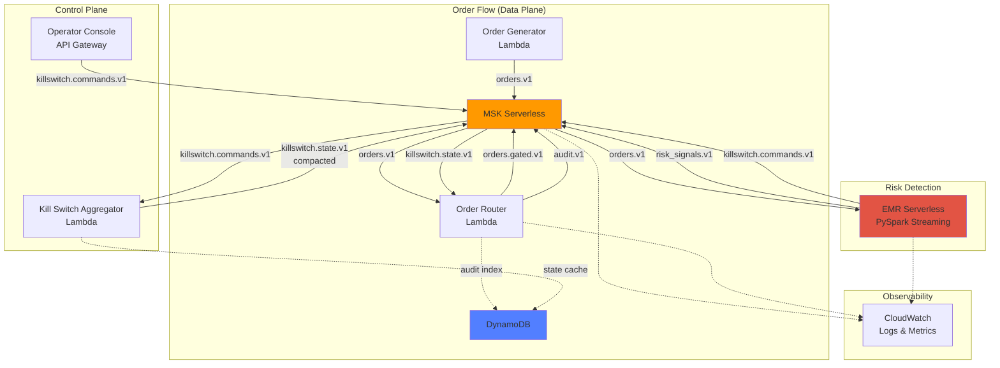

# Architecture Overview

## System Architecture

This demo implements a real-time risk control system for brokerage order flow using event-driven architecture patterns.

### High-Level Architecture



## Control Plane vs Data Plane

### Data Plane
The data plane handles the actual order flow:
- **Order Generator**: Produces synthetic orders
- **Order Router**: Enforces kill switch state on every order
- **Gated Orders**: Orders that passed validation
- **Audit Trail**: Immutable log of all decisions

### Control Plane
The control plane manages kill switch state:
- **Operator Console**: Manual kill/unkill via API
- **Kill Switch Aggregator**: Consumes commands, produces authoritative state
- **State Topic**: Compacted Kafka topic with latest status per scope

### Detection (Separate from Control)
Risk detection is decoupled from enforcement:
- **Spark Streaming**: Analyzes patterns, emits signals and commands
- **Risk Signals**: Windowed aggregations (order rate, notional, concentration)
- **Kill Commands**: Automated triggers when thresholds breached

## Kafka Topics

### orders.v1
- **Purpose**: Raw order events from generator
- **Key**: account_id (for partitioning)
- **Partitions**: 3
- **Retention**: 7 days (default)

**Schema**:
```json
{
  "order_id": "uuid",
  "ts": 1710000000000,
  "account_id": "12345",
  "symbol": "AAPL",
  "side": "BUY|SELL",
  "qty": 200,
  "price": 185.12,
  "strategy": "ALGO_X"
}
```

### risk_signals.v1
- **Purpose**: Windowed risk metrics from Spark
- **Key**: account_id
- **Partitions**: 3

**Schema**:
```json
{
  "ts": 1710000000000,
  "account_id": "12345",
  "window_start": 1710000000000,
  "window_end": 1710000060000,
  "order_rate_60s": 150,
  "rolling_notional_60s": 2500000.00,
  "top_symbol": "AAPL",
  "top_symbol_share": 0.85
}
```

### killswitch.commands.v1
- **Purpose**: Kill/unkill commands (from Spark or operator)
- **Key**: scope
- **Partitions**: 3
- **Retention**: 30 days (full audit trail)

**Schema**:
```json
{
  "cmd_id": "uuid",
  "ts": 1710000000000,
  "scope": "GLOBAL|ACCOUNT:123|SYMBOL:AAPL",
  "action": "KILL|UNKILL",
  "reason": "Order rate breach: 150 orders in 60s",
  "triggered_by": "spark|operator",
  "metric": "order_rate_60s",
  "value": 150,
  "corr_id": "uuid"
}
```

### killswitch.state.v1 (COMPACTED)
- **Purpose**: Authoritative kill state per scope
- **Key**: scope (e.g., "ACCOUNT:12345")
- **Partitions**: 3
- **Cleanup Policy**: compact
- **Compaction Settings**:
  - `min.cleanable.dirty.ratio=0.01` (compact frequently)
  - `segment.ms=60000` (small segments)

**Schema**:
```json
{
  "scope": "ACCOUNT:12345",
  "status": "KILLED|ACTIVE",
  "updated_ts": 1710000000000,
  "updated_by": "spark|operator",
  "reason": "Order rate breach",
  "last_cmd_id": "uuid",
  "corr_id": "uuid"
}
```

### orders.gated.v1
- **Purpose**: Orders that passed kill switch check
- **Key**: account_id
- **Schema**: Same as orders.v1

### audit.v1
- **Purpose**: Immutable audit trail of routing decisions
- **Key**: order_id
- **Partitions**: 3
- **Retention**: 90 days

**Schema**:
```json
{
  "ts": 1710000000000,
  "decision": "ALLOW|DROP",
  "order_id": "uuid",
  "account_id": "12345",
  "symbol": "AAPL",
  "scope_matches": ["GLOBAL", "ACCOUNT:12345"],
  "killswitch_status": "KILLED|ACTIVE",
  "reason": "Kill switch active for ACCOUNT:12345",
  "corr_id": "uuid",
  "service": "order_router"
}
```

## Kill Switch Scopes

The system supports hierarchical kill scopes:

1. **GLOBAL**: Stops all orders system-wide
2. **ACCOUNT:<account_id>**: Stops orders for specific account
3. **SYMBOL:<symbol>**: Stops orders for specific symbol

The order router checks scopes in order and drops the order if any scope is KILLED.

## Kafka Compaction Deep Dive

### Why Compaction?

Traditional Kafka topics retain all messages for a retention period. Compacted topics retain only the latest value for each key, making them ideal for "configuration" or "state" data.

For kill switch state:
- We need the latest status per scope
- New consumers must bootstrap current state quickly
- We want full history in commands topic, but only latest state in state topic

### How It Works

```
Commands Topic (retain all):
ACCOUNT:123 -> KILL   (t=100)
ACCOUNT:123 -> UNKILL (t=200)
ACCOUNT:123 -> KILL   (t=300)

State Topic (compacted, only latest):
ACCOUNT:123 -> KILL   (t=300)
```

### Compaction Timing

Compaction runs in the background based on:
- `min.cleanable.dirty.ratio`: Minimum ratio of dirty (uncompacted) to total log
- `segment.ms`: How often to roll new segments
- `delete.retention.ms`: How long to retain tombstones (null values)

Our settings prioritize fast propagation for demos.

## Spark Streaming Job

### Architecture

The Spark job uses Structured Streaming to:
1. Read orders from Kafka
2. Compute windowed aggregations using Spark SQL
3. Detect threshold breaches
4. Emit risk signals and kill commands back to Kafka

### Windowing

Uses 60-second tumbling windows per account:

```sql
SELECT
    window(event_time, '60 seconds') as window,
    account_id,
    COUNT(*) as order_count,
    SUM(qty * price) as total_notional
FROM orders
GROUP BY window(event_time, '60 seconds'), account_id
```

### Thresholds

Configurable via Terraform variables:
- `order_rate_threshold_60s`: Max orders per 60s window (default: 100)
- `notional_threshold_60s`: Max $ notional per 60s window (default: $1M)
- `symbol_concentration_threshold`: Max % of orders in single symbol (default: 0.7)

### Checkpointing

Spark maintains checkpoints in S3 for fault tolerance and exactly-once processing.

## DynamoDB Tables

### audit-index
- **Purpose**: Queryable audit trail (Kafka is source of truth)
- **Key**: order_id (hash), ts (range)
- **GSI**: account_id-index for account-level queries
- **TTL**: 30 days

### state-cache
- **Purpose**: Fast lookup cache for kill state (Kafka is source of truth)
- **Key**: scope
- **TTL**: 7 days

DynamoDB provides fast queries for operational dashboards, but Kafka topics remain the authoritative source.

## Correlation IDs

Every command and audit event includes a correlation ID (`corr_id`) for traceability:
- Track a kill command from trigger through enforcement
- Debug why an order was dropped
- Audit trail for compliance

## Idempotency

The system is designed for idempotent operations:
- Commands have unique `cmd_id`
- State updates are keyed by scope (last write wins)
- Audit events are append-only

## Security Model

### IAM Roles
Separate least-privilege roles for each Lambda:
- Order Generator: Write to orders.v1
- Kill Switch Aggregator: Read commands, write state
- Order Router: Read orders and state, write gated and audit
- Operator Console: Write commands

### MSK Authentication
Uses IAM authentication (SASL_IAM) for Kafka access.

### Network Isolation
- MSK and Lambdas in private subnets
- VPC endpoints for S3, DynamoDB, CloudWatch
- No public internet access required (low-cost mode)

## Observability

### CloudWatch Logs
Each Lambda writes structured logs:
- Order counts and rates
- Kill switch triggers
- Dropped orders with reasons

### CloudWatch Metrics
- Lambda invocations, errors, duration
- Custom metrics for order rates (optional)

### CloudWatch Dashboard
Pre-built dashboard showing:
- Lambda invocations
- Error rates
- Recent dropped orders
- Risk signal trends

## Failure Modes and Recovery

### Spark Job Failure
- Checkpoints enable restart from last processed offset
- Kill switch state remains authoritative
- Manual operator override always available

### Lambda Failure
- Automatic retries with exponential backoff
- Dead letter queues (optional, not in demo)
- CloudWatch alarms (optional, not in demo)

### Kafka Partition Failure
- MSK Serverless handles replication automatically
- Compacted topic ensures state is recoverable

### Network Partition
- Lambdas in VPC with multiple AZs (if not low-cost mode)
- VPC endpoints reduce NAT gateway dependency

## Next Steps

- [01-prereqs.md](01-prereqs.md): Setup requirements
- [02-deploy-aws.md](02-deploy-aws.md): Deploy to AWS
- [03-run-demo.md](03-run-demo.md): Run the demo
- [04-observe.md](04-observe.md): Observability guide
