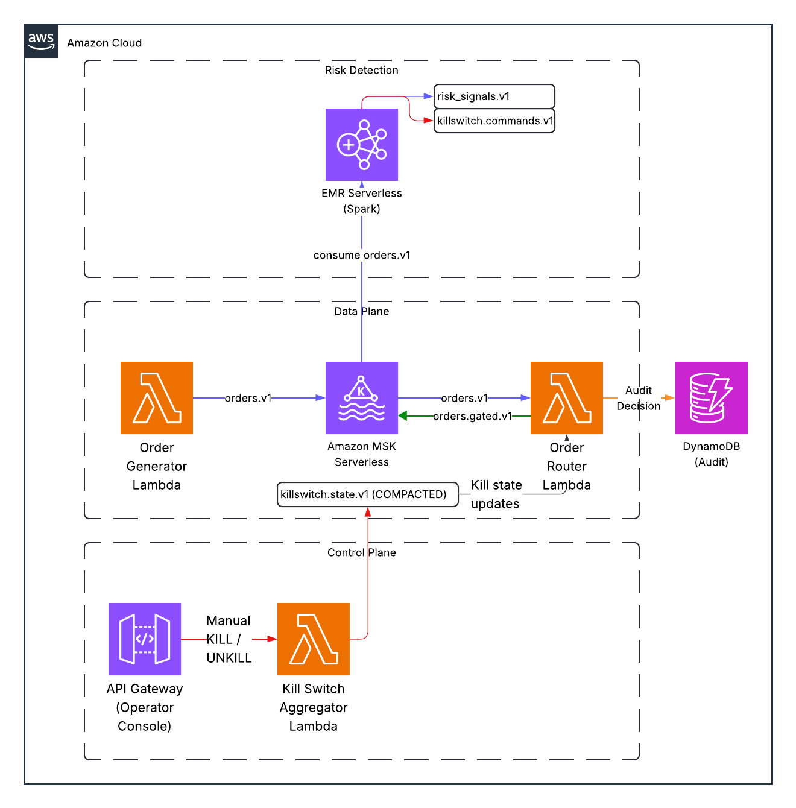

# Section 3: System Architecture

**Duration:** 5 minutes
**Goal:** Walk through the architecture diagram so every component and data flow is understood before diving into code.

---

## Opening

> "Let me walk you through the architecture. There are four services, one Spark job, and Kafka tying everything together."

Pull up the architecture diagram (slide 4 or the image below). Walk through it **top to bottom, left to right**, following the data flow.



---

## The Data Flow

### Step 1: Orders Enter the System

> "Orders come into the system through the **Order Generator**. In production, this would be customer orders arriving from trading desks, algorithms, or client APIs. Here, it's a Python service generating synthetic orders at 5 per second."

**Point to the code concept (don't show code yet — that comes in later sections):**

> "Each order has an account ID, a symbol like AAPL or TSLA, a quantity, a price, and a strategy tag. The generator publishes these to a Kafka topic called `orders.v1`."

The order schema (from `generate_local.py` lines 56-65):
```
{
  "order_id":    "uuid",
  "ts":          1234567890000,    // epoch millis
  "account_id":  "12345",
  "symbol":      "AAPL",
  "side":        "BUY",
  "qty":         100,
  "price":       150.25,
  "strategy":    "ALGO_X"
}
```

> "This schema is important — every downstream service depends on these fields. The `account_id` is the partition key in Kafka, which means all orders for the same account land on the same partition, in order."

### Step 2: Two Consumers, Two Jobs

> "Two things consume from `orders.v1` simultaneously. This is the power of Kafka's consumer group model — multiple independent consumers reading the same stream of data for different purposes."

**Consumer 1: The Spark Risk Detector**

> "Spark is doing real-time analysis. It reads every order, groups them into 60-second windows per account, and computes risk metrics: how many orders, how much dollar exposure, how concentrated in a single symbol. If any metric crosses a threshold, Spark emits a KILL command."

> "Spark is the **detection** layer. It watches. It measures. It raises alarms."

**Consumer 2: The Order Router**

> "The Order Router is doing enforcement. For every order, it checks the current kill switch state. If the account is killed, the order is dropped. If it's not, the order passes through to `orders.gated.v1` — the 'gated' topic represents orders that have been approved to reach the market."

> "The router is the **enforcement** layer. It gates. It blocks. It allows."

### Step 3: The Control Plane

> "Between detection and enforcement sits the control plane. This is two components: the Kill Switch Aggregator and the compacted state topic."

> "When Spark detects a breach, it emits a KILL command to `killswitch.commands.v1`. The aggregator reads that command, translates it into a state record — 'account 12345 is now KILLED' — and writes it to `killswitch.state.v1`, which is a **compacted topic**."

> "The router reads from that compacted topic to know the current state. We'll dig into what compaction means in the next section."

### Step 4: The Human Interface

> "Finally, the Operator Console. This is a Flask REST API with two endpoints: POST /kill and POST /unkill. When an operator calls /kill, it publishes a command to the same `killswitch.commands.v1` topic that Spark writes to."

> "This means the aggregator doesn't care **who** triggered the kill — Spark or a human. It processes both the same way. The `triggered_by` field records the source for the audit trail."

---

## The Separation Principle

This is the single most important architectural point. Say it explicitly and make them remember it.

> "Notice the separation. **Detection** is separate from **control** is separate from **enforcement.**"

> "Spark detects. The compacted topic is the control plane. The router enforces."

Now explain why this matters with failure scenarios:

> "If Spark goes down — maybe the container crashes, maybe the cluster runs out of memory — the last known kill state is still in the compacted topic. The router keeps enforcing it. Detection stops, but enforcement continues."

> "If a human spots something Spark didn't catch — maybe a compliance officer sees unusual trading on a dashboard — they can kill directly through the API. They don't need Spark's permission."

> "If the router restarts — it bootstraps its state from the compacted topic on startup. Within seconds, it knows every active kill switch and starts enforcing again."

> "No single component failure breaks the safety guarantees. That's not an accident — that's the architecture."

---

## The Six Kafka Topics

Show the topic map. This is a reference they'll need for the rest of the talk.

| Topic | Purpose | Retention | Key |
|-------|---------|-----------|-----|
| `orders.v1` | Raw incoming orders | 7 days | `account_id` |
| `risk_signals.v1` | Spark aggregation outputs | 7 days | `account_id` |
| `killswitch.commands.v1` | Kill/unkill commands | 30 days | `scope` |
| `killswitch.state.v1` | Current kill state (**compacted**) | Forever | `scope` |
| `orders.gated.v1` | Approved orders for market | 7 days | `account_id` |
| `audit.v1` | Every routing decision | 90 days | `order_id` |

> "Six topics. Each has a specific job. Notice the retention policies — the audit topic keeps data for 90 days because regulators might ask for it. The state topic is compacted, not time-retained — it keeps the latest value per key forever."

---

## Docker Compose: How It All Runs

> "Locally, all of this runs in Docker Compose. One command: `docker compose up --build -d`. You get Kafka in KRaft mode, all four services, the Spark job, and a Kafka UI called AKHQ."

Reference `local/docker-compose.yml`:
- Kafka: Confluent 7.5.0, KRaft mode (no ZooKeeper), ports 9092/29092
- Topic creator: runs once, creates all 6 topics with correct configs
- AKHQ: Kafka web UI on port 8080
- Four Python services + one Spark job

> "The dependency chain matters. Kafka starts first. The topic creator waits for Kafka to be healthy, creates topics, then exits. All services wait for both Kafka and the topic creator. This is defined with `depends_on` and `condition: service_healthy` in the compose file."

---

## Presenter Notes

**Use the diagram.** Point at it physically. Trace the data flow with your finger or a laser pointer. The audience should be able to follow the path of a single order from entry to exit.

**If someone asks "why Kafka and not [X]?":** Kafka gives you durable, ordered, replayable event streams. You could use RabbitMQ for messaging, but you'd lose replay and compaction. You could use a database, but you'd lose real-time pub/sub. Kafka is the right tool when you need both.

**If someone asks "why not put the risk check in the router?":** Separation of concerns. The router should be fast and simple — check state, make a decision, move on. Risk detection is computationally expensive (windowed aggregations). Combining them means a slow router or a compromised detection algorithm. Separation lets each scale independently.

---

## Timing Check

By the end of this section, you should be at **16 minutes** total. The audience now understands the problem (Knight Capital), the requirements (the rule), and the solution (the architecture). Everything from here is code-level detail.
